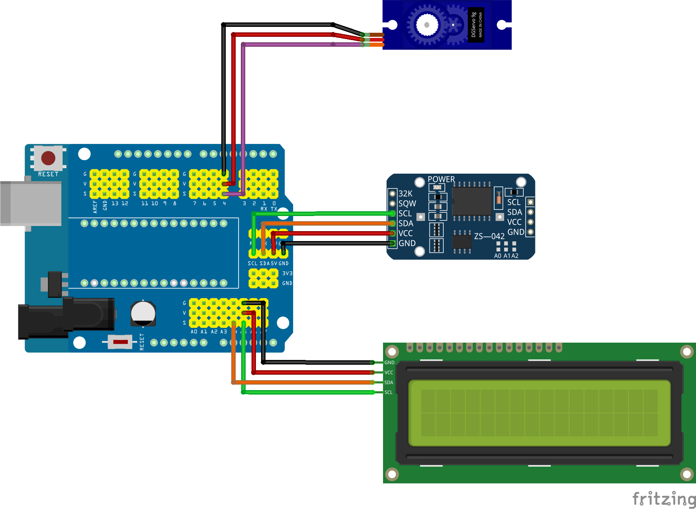

## Arduino-Automatic-Betta-Fish-Feed

## Overview

This Arduino sketch integrates an RTC module, an LCD display, and a servo motor to create a system that displays the current date and time, along with performing specific actions based on the time.

## Features

- Date and Time Display: Shows current date, time, and temperature on the LCD.
- Feeding Action: Controls the servo motor to perform a feeding action at specified times.
- Temperature Monitoring: Displays the temperature from the RTC module.

## Schematic



## Key Components

1. RTC (Real-Time Clock):

   - Uses the DS3231 RTC module to keep track of the current date and time.
   - Displays the date and time on the LCD.
   - Reads the temperature from the RTC.

2. LCD (Liquid Crystal Display):

   - Displays the current date, time, and temperature on a 16x2 LCD screen.

3. Servo Motor:
   - A servo motor is controlled to perform actions at specific times.

## Code Overview

```cpp
// Import lib RTC and configuration
#include "RTClib.h"
RTC_DS3231 rtc;
char daysOfTheWeek[7][12] = {"Ahad", "Senin", "Selasa", "Rabu", "Kamis", "Jum'at", "Sabtu"};
int jam, menit, detik;
int tanggal, bulan, tahun;
String hari;
float suhu;

// Import lib LCD
#include <LiquidCrystal_I2C.h>
LiquidCrystal_I2C lcd(0x27, 16, 2);

// Import lib SERVO
#include <Servo.h>
Servo mechanic;

void setup() {
  Serial.begin(9600);

  // RTC
  if (! rtc.begin()) {
    Serial.println("Couldn't find RTC");
    Serial.flush();
    while (1) delay(10);
  }
  // rtc.adjust(DateTime(F(__DATE__), F(__TIME__)));
  // rtc.adjust(DateTime(2014, 1, 21, 3, 0, 0));

  // LCD
  // lcd.begin();
  // if there is an error, change it lcd.begin(); so the code is below:
  lcd.init();
  lcd.backlight();

  // SERVO pin D4
  mechanic.attach(4);
  mechanic.write(0);
}

void loop() {

  // Settings Time (RTC)
  DateTime now = rtc.now();
  jam     = now.hour();
  menit   = now.minute();
  detik   = now.second();
  tanggal = now.day();
  bulan   = now.month();
  tahun   = now.year();
  hari    = daysOfTheWeek[now.dayOfTheWeek()];
  suhu    = rtc.getTemperature();
  Serial.println(String() + hari + ", " + tanggal + "-" + bulan + "-" + tahun);
  Serial.println(String() + jam + "-" + menit + "-" + tahun);
  Serial.println();

  // LCD
  lcd.setCursor(0, 0);
  lcd.print(String() + hari + "," + tanggal + "-" + bulan + "-" + tahun);
  lcd.print(" ");
  lcd.setCursor(0, 1);
  lcd.print(String() + jam + "-" + menit + "-" + tahun);
  lcd.print("  ");
  lcd.print(suhu);
  lcd.print(" ");

  // Conditioning Feeding
  if ( (jam == 22) && (menit == 45) && (detik == 1) ) {
    feeding(5);
  }
  if ( (jam == 22) && (menit == 46) && (detik == 1) ) {
    feeding(5);
  }

}

void feeding(int jumlah) {
  for (int i = 1; i <= jumlah; i++) {
    mechanic.write(150);
    delay(100);
    mechanic.write(0);
    delay(100);
  }
}
```

## Code Description

1. Libraries and Initialization:

   - Includes necessary libraries for RTC (RTClib.h), LCD (LiquidCrystal_I2C.h), and Servo (Servo.h).
   - Initializes the RTC, LCD, and Servo objects.

2. Setup Function:

   - Initializes serial communication.
   - Checks if the RTC is connected properly.
   - Initializes the LCD and sets up the servo motor.

3. Loop Function:

   - Retrieves current time and date from the RTC.
   - Displays the time, date, and temperature on the LCD.
   - Checks if the current time matches specific conditions (e.g., 22:45:01 and 22:46:01) and triggers the feeding() function to control the servo motor.

4. feeding() Function:
   - Moves the servo motor to dispense a specified amount of food (or perform an action) by making the servo move to a specific angle and then back.

## Installation

1. Connect the Hardware:

   - Connect the RTC module, LCD, and servo motor to your Arduino board according to the wiring specifications.

2. Upload the Code:

   - Load the provided code onto your Arduino board using the Arduino IDE.

3. Libraries:
   - Ensure you have the following libraries installed:
     - RTClib
     - LiquidCrystal_I2C
     - Servo

## Potential Improvements

- Error Handling: Add error handling for the RTC initialization.
- Configuration: Adjust the LCD initialization and RTC adjustment lines based on your specific hardware setup.
- Optimization: Ensure that servo actions are synchronized correctly and avoid overlapping actions.

## Usage

- LCD Display: Monitors and displays the current date, time, and temperature.
- Servo Motor: Activated to perform actions based on the time conditions set in the code.

## Example Usage

- Current Time Display: The LCD shows the current date, time, and temperature.
- Servo Control: The servo dispenses food at specified times, which can be adjusted based on your requirements.

## Notes

- Adjust the RTC settings if necessary to match your local time.
- Modify the servo motor control timings in the feeding function as needed for your application.
